# 📈 Real-Time Stock Market Data Analytics Pipeline on AWS

> Event-driven architecture | Serverless technologies | Real-time data ingestion | AWS Kinesis • Lambda • DynamoDB • S3 • Athena • SNS

---

## 📋 Overview

This project builds a **real-time stock market data analytics pipeline** using AWS, leveraging event-driven architecture and serverless technologies. The architecture ingests, processes, stores, and analyzes stock market data in real-time while minimizing costs.

### Key Features
- 📡 Stream real-time stock data from **Yahoo Finance** using **Amazon Kinesis Data Streams**
- ⚡ Process data and detect anomalies with **AWS Lambda**
- 🗄️ Store processed stock data in **Amazon DynamoDB** for low-latency querying
- 🪣 Store raw stock data in **Amazon S3** for long-term analytics
- 🔍 Query historical data using **Amazon Athena**
- 🔔 Send real-time stock trend alerts using **AWS Lambda & Amazon SNS** (Email/SMS)

---

## 🏗️ Architecture

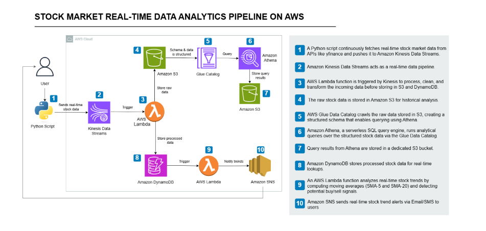

---

## 🛠️ Services Used

| Service | Purpose |
|---|---|
| **Amazon Kinesis Data Streams** | Ingests stock data in real-time |
| **AWS Lambda** | Processes stock data and detects stock trends |
| **Amazon DynamoDB** | Stores structured stock data for quick lookups |
| **Amazon S3** | Stores raw stock data for historical analysis |
| **Amazon Athena** | Queries stock data directly from S3 |
| **Amazon SNS** | Sends stock trend alerts via Email/SMS |
| **IAM Roles & Policies** | Manages permissions securely |

---

## ⚙️ Estimated Time & Cost

- ⏱️ **Time:** ~2-3 hours
- 💰 **Cost:** ~$1 to ~$2

---

## 📌 Steps to be Performed

1. [Setting Up Data Streaming with Amazon Kinesis](#1-setting-up-data-streaming-with-amazon-kinesis)
2. [Processing Data with AWS Lambda](#2-processing-data-with-aws-lambda)
3. [Query Historical Stock Data using Amazon Athena](#3-query-historical-stock-data-using-amazon-athena)
4. [Stock Trend Alerts using SNS](#4-stock-trend-alerts-using-sns)

---

## 1. Setting Up Data Streaming with Amazon Kinesis

### Steps
1. Create a Kinesis Data Stream
2. Set Up Your Local Python Environment
3. Write the Python Script to Stream Stock Data
4. Run the Script and Verify Data Streaming

---

### 1.1 Create a Kinesis Data Stream

Amazon Kinesis Data Streams is a managed service that collects and processes real-time data streams with minimal latency.

**a.** Log in to the AWS Management Console

**b.** Search for **Kinesis** in the AWS search bar and open it:

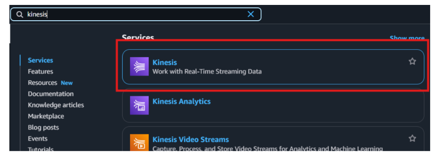

**c.** Click **Create data stream**

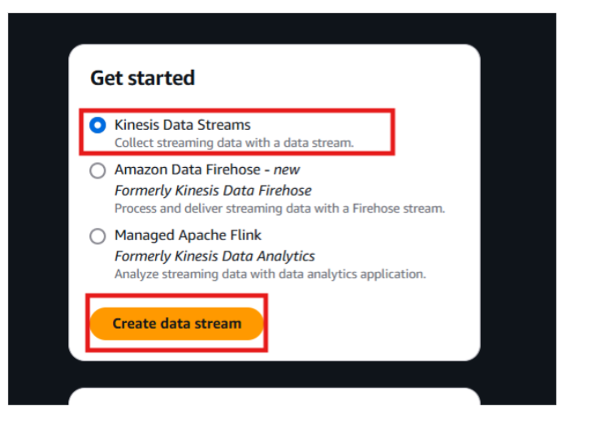

**d.** Configure the Stream:
- **Stream name** → `stock-market-stream`
- **Data Stream Capacity Mode** → Select **On-demand** (free-tier friendly)
- **Retention Period** → Keep the default 24 hours

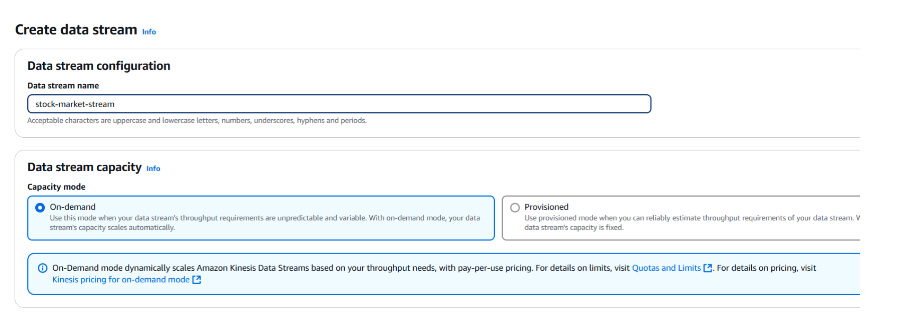

**e.** Click **Create data stream**

Your Kinesis Data Stream is now ready! ✅

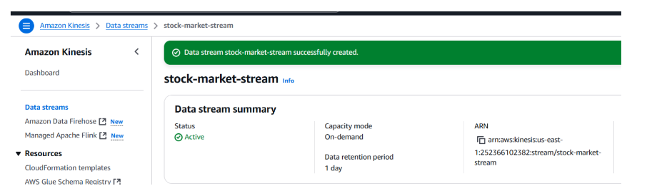

---

### 1.2 Set Up Your Local Python Environment

**1. Check Python version**

```bash
python --version
```

> If not installed, download it from [python.org](https://www.python.org/downloads/)

**2. Install Required Python Libraries**

```bash
pip install boto3 yfinance
```

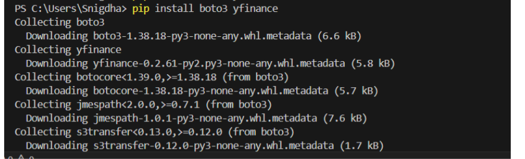

- `boto3` — AWS SDK for Python (to interact with AWS services)
- `yfinance` — Fetch latest stock prices from Yahoo Finance

**3. Configure AWS Credentials**

```bash
aws configure
```

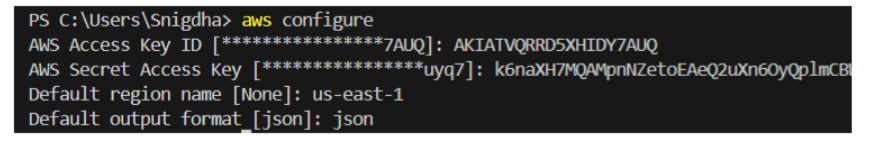

Enter the following when prompted:

AWS Access Key ID     → Enter your key
AWS Secret Access Key → Enter your secret
Default region name   → us-east-1 (or your region)
Default output format → press Enter

> **Why?** AWS CLI stores your credentials so boto3 can automatically authenticate your requests.

---

### 1.3 Write the Python Script to Stream Stock Data

**1.** Create a new file called `stream_stock_data.py`

**2.** Copy and paste the script below:

```python
import boto3
import json
import time
import yfinance as yf

# AWS Kinesis Configuration
kinesis_client = boto3.client('kinesis', region_name='us-east-1')
STREAM_NAME = "<YOUR_DATA_STREAM_NAME>"  # Replace with your actual stream name
STOCK_SYMBOL = "AAPL"
DELAY_TIME = 30  # Time delay in seconds

# Function to fetch stock data
def get_stock_data(symbol):
    try:
        stock = yf.Ticker(symbol)
        data = stock.history(period="2d")  # Fetch last 2 days to get previous close

        if len(data) < 2:
            raise ValueError("Insufficient data to fetch previous close.")

        stock_data = {
            "symbol": symbol,
            "open": round(data.iloc[-1]["Open"], 2),
            "high": round(data.iloc[-1]["High"], 2),
            "low": round(data.iloc[-1]["Low"], 2),
            "price": round(data.iloc[-1]["Close"], 2),
            "previous_close": round(data.iloc[-2]["Close"], 2),
            "change": round(data.iloc[-1]["Close"] - data.iloc[-2]["Close"], 2),
            "change_percent": round(((data.iloc[-1]["Close"] - data.iloc[-2]["Close"]) / data.iloc[-2]["Close"]) * 100, 2),
            "volume": int(data.iloc[-1]["Volume"]),
            "timestamp": time.strftime("%Y-%m-%dT%H:%M:%SZ", time.gmtime())
        }
        return stock_data
    except Exception as e:
        print(f"Error fetching stock data: {e}")
        return None

# Function to stream data into Kinesis
def send_to_kinesis():
    while True:
        try:
            stock_data = get_stock_data(STOCK_SYMBOL)
            if stock_data is None:
                print("Skipping this iteration due to API error.")
                time.sleep(DELAY_TIME)
                continue

            print(f"Sending: {stock_data}")

            # Send to Kinesis
            response = kinesis_client.put_record(
                StreamName=STREAM_NAME,
                Data=json.dumps(stock_data),
                PartitionKey=STOCK_SYMBOL
            )

            # Debugging Response
            if response["ResponseMetadata"]["HTTPStatusCode"] == 200:
                print(f"Kinesis Response: {response}")
            else:
                print(f"Error sending to Kinesis: {response}")

            time.sleep(DELAY_TIME)  # Send data every 30 seconds

        except Exception as e:
            print(f"Error: {e}")
            time.sleep(DELAY_TIME)

# Run the streaming function
send_to_kinesis()
```

> ⚠️ **Remember** to replace `<YOUR_DATA_STREAM_NAME>` with the actual name of your Kinesis Data Stream.

**What This Code Does:**

| Step | Description |
|---|---|
| **Fetches Stock Data** | Retrieves Open, High, Low, Close, Volume and Previous Close for AAPL |
| **Formats Data** | Converts stock data into a structured JSON object with timestamp |
| **Streams to Kinesis** | Sends JSON-encoded data to Kinesis every 30 seconds |
| **Handles Errors** | Waits and retries if API fails instead of crashing |
| **Logs Output** | Prints each record and Kinesis response to terminal |

**Sample record sent to Kinesis:**

```json
{
  "symbol": "AAPL",
  "open": 211.25,
  "high": 213.95,
  "low": 209.58,
  "price": 213.49,
  "previous_close": 209.68,
  "change": 3.81,
  "change_percent": 1.82,
  "volume": 60107582,
  "timestamp": "2025-03-16T09:05:09Z"
}
```

---

### 1.4 Run the Script and Verify Data Streaming

**1.** Run the Python Script:

```bash
python stream_stock_data.py
```

**Expected Output:**
Sending: {'symbol': 'AAPL', 'open': 211.25, 'high': 213.95, 'low': 209.58, 'price': 213.49,
'previous_close': 209.68, 'change': 3.81, 'change_percent': 1.82, 'volume': 60060200,
'timestamp': '2025-03-16T09:25:45Z'}
Kinesis Response: {'ShardId': 'shardId-000000000002', 'SequenceNumber': '4966146277844746...'}

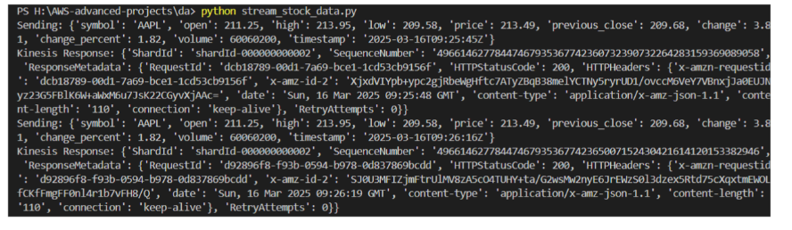

**2.** Verify Data in Kinesis:
- Open **AWS Console → Kinesis → stock-market-stream**
- Click **Monitoring**
- Check **Incoming Records** graph:

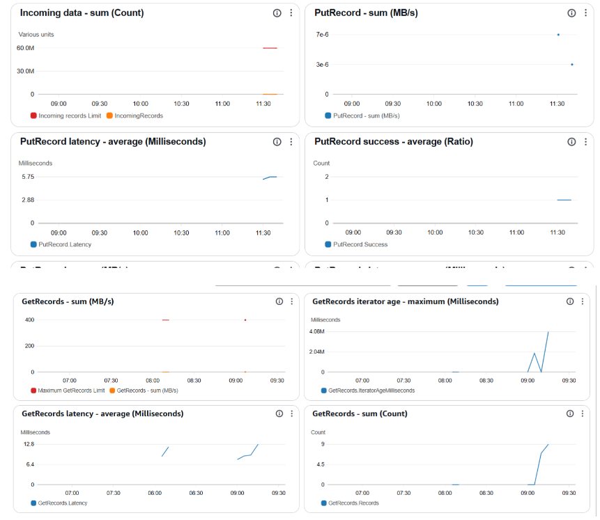

> You can also check the **Data Viewer** tab and select **Trim Horizon** as your starting position to view stored records.

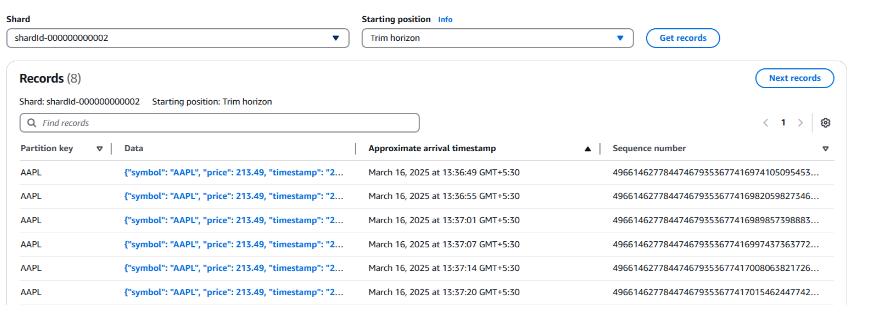

> ⚠️ **IMPORTANT:** Stop your Python script using `CTRL+C` when you no longer need to stream data. If left running, it will send records to Kinesis every 30 seconds and may exceed Free Tier limits.

✅ **Congratulations!** You have successfully streamed real-time stock data into Amazon Kinesis!

---

## 2. Processing Data with AWS Lambda

### Steps
1. Create a DynamoDB Table for storing Processed Stock Data
2. Create S3 Bucket for storing Raw Stock Data
3. Configure AWS Lambda in the AWS Console
4. Test the Integration

---

### 2.1 Create a DynamoDB Table

**Why DynamoDB?**

| Feature | Benefit |
|---|---|
| Fast read/write | Low-latency querying |
| Flexible schema | Easy adjustments to stock data fields |
| Scalability | Handles high-volume stock transactions |

**Stock data fields stored in DynamoDB:**

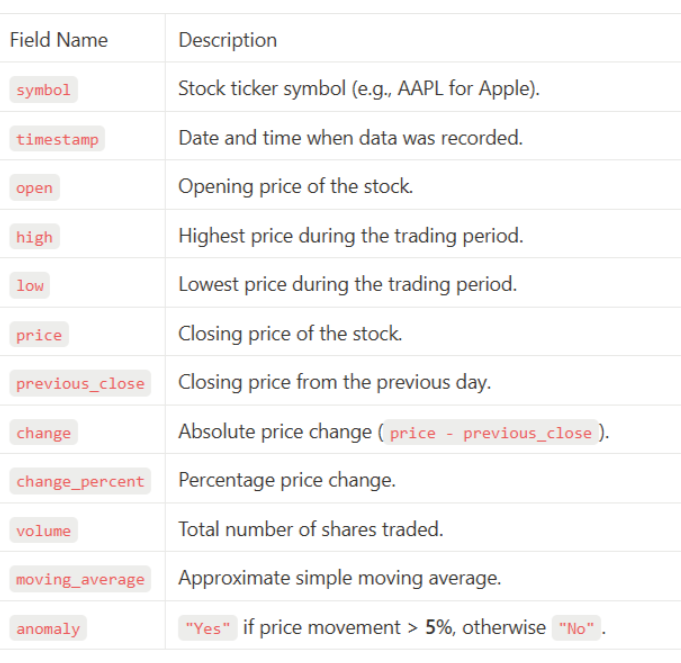

**1.** Open **AWS Console → DynamoDB**

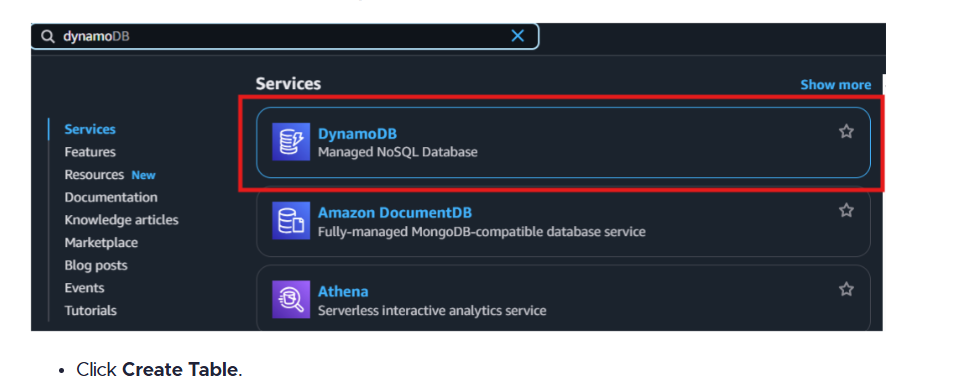

**2.** Click **Create Table**

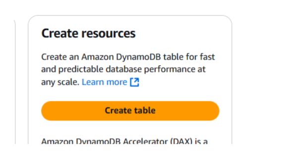

**3.** Configure the table:
- **Table Name:** `stock-market-data`
- **Partition Key:** `symbol` (String)
- **Sort Key:** `timestamp` (String)

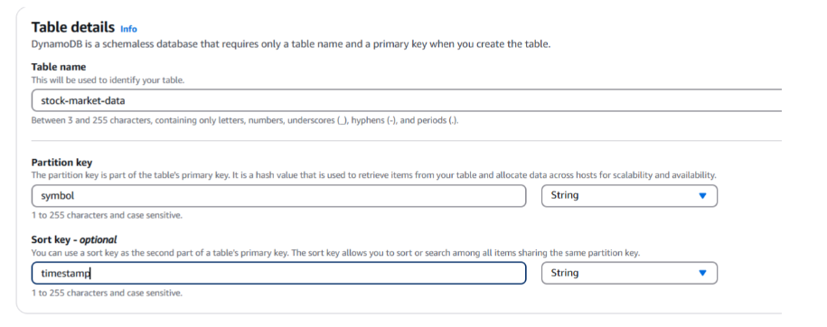

**4.** Keep default settings and click **Create Table**

---

### 2.2 Create S3 Bucket for Raw Stock Data

**Why S3?**

- 📦 **Long-term storage** → Store raw stock data for historical analysis
- 🤖 **Batch processing** → Useful for training ML models on stock trends
- 🔍 **Flexible querying** → Query historical data using Amazon Athena

**1.** Open **AWS Console → S3 → Create bucket**
- **Bucket Name:** `stock-market-data-bucket-33454` (use a unique name)
- **Region:** Same region as your Lambda function
- Keep **Block Public Access** enabled
- Click **Create bucket**

---

### 2.3 Configure AWS Lambda

**Why Lambda for Processing?**
Raw Kinesis Data
↓
AWS Lambda
├── Structures data → DynamoDB (fast retrieval)
├── Computes metrics → Price changes, moving averages
├── Detects anomalies → Flags sudden spikes/drops
└── Stores raw data → S3 bucket

**1. Create IAM Role for Lambda**

- Open **AWS Console → IAM → Roles → Create Role**
- **Trusted Entity:** AWS Service → Lambda

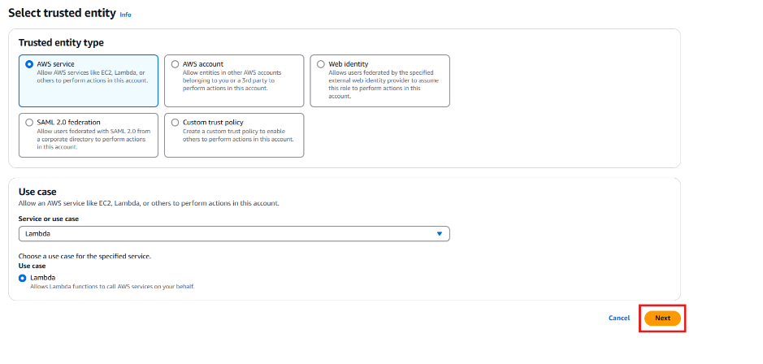

- **Attach these policies:**
  - `AmazonKinesisFullAccess` — Read from Kinesis
  - `AmazonDynamoDBFullAccess` — Write to DynamoDB
  - `AWSLambdaBasicExecutionRole` — CloudWatch logging
  - `AmazonS3FullAccess` — Write to S3
- **Role Name:** `Lambda_Kinesis_DynamoDB_Role`

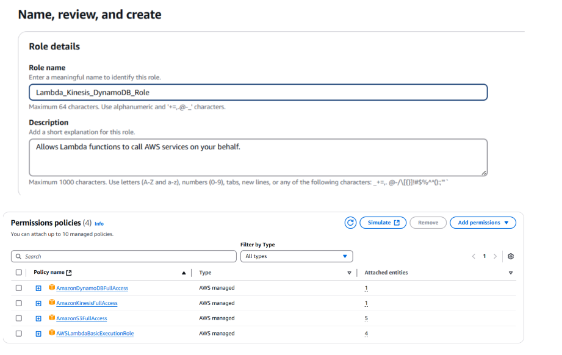

**2. Create Lambda Function**

- Open **AWS Console → Lambda**

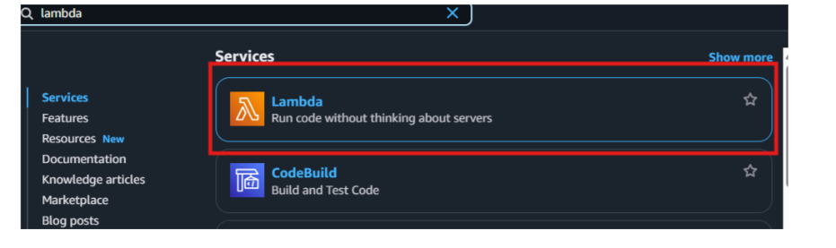

- Click **Create Function → Author from Scratch**
  - **Function Name:** `ProcessStockData`
  - **Runtime:** Python 3.13
  - **Execution Role:** `Lambda_Kinesis_DynamoDB_Role`

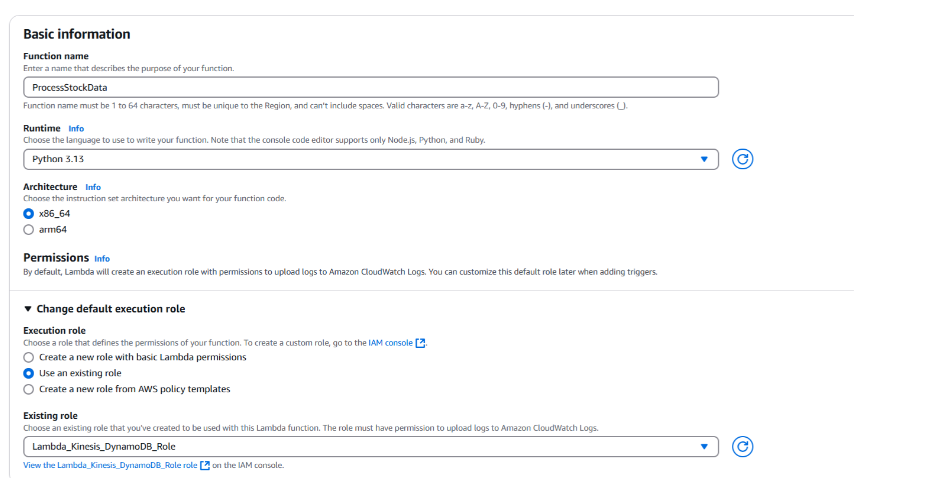

- Click **Create Function**

**3. Add Kinesis Trigger**

- In **Function Overview** → Click **Add Trigger**

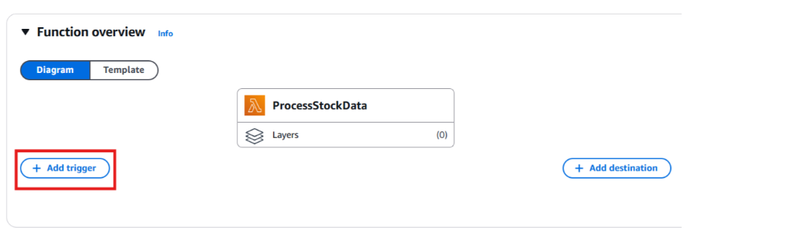

- Select **Kinesis** → Choose `stock-market-stream`

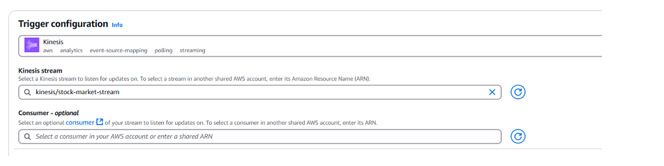

- Set **Batch size:** `2`

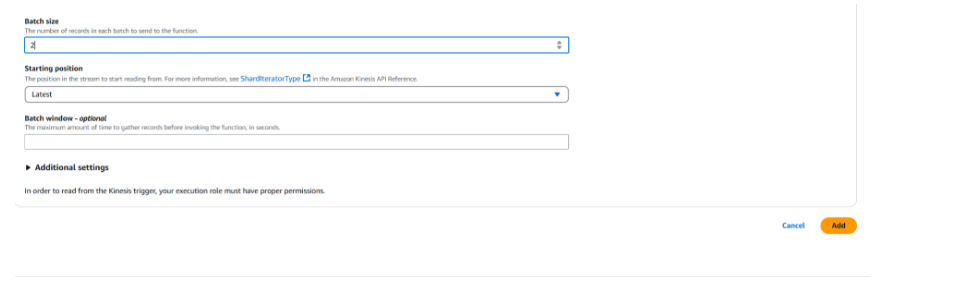

> **Understanding Batch Size:** The Lambda function waits for 2 records (1 minute at 30-second intervals) before triggering. Adjust batch size based on your record generation frequency.

**4. Deploy Lambda Code**

Paste the following code into the Lambda editor and click **Deploy**:

```python
import json
import boto3
import base64
from decimal import Decimal

# Initialize AWS Clients
dynamodb = boto3.resource("dynamodb")
s3 = boto3.client("s3")

# Resource Names
DYNAMO_TABLE = "stock-market-data"
S3_BUCKET = "stock-market-data-bucket-33454"

# Table reference
table = dynamodb.Table(DYNAMO_TABLE)

def lambda_handler(event, context):
    for record in event['Records']:
        try:
            # Decode base64 Kinesis data
            raw_data = base64.b64decode(record["kinesis"]["data"]).decode("utf-8")
            payload = json.loads(raw_data)
            print(f"Processing record: {payload}")

            # Store raw data in S3
            try:
                s3_key = f"raw-data/{payload['symbol']}/{payload['timestamp'].replace(':', '-')}.json"
                s3.put_object(
                    Bucket=S3_BUCKET,
                    Key=s3_key,
                    Body=json.dumps(payload),
                    ContentType='application/json'
                )
                print(f"Raw data saved to S3: {s3_key}")
            except Exception as s3_error:
                print(f"Failed to save raw data to S3: {s3_error}")

            # Compute stock metrics
            price_change = round(payload["price"] - payload["previous_close"], 2)
            price_change_percent = round((price_change / payload["previous_close"]) * 100, 2)
            is_anomaly = "Yes" if abs(price_change_percent) > 5 else "No"
            moving_average = (payload["open"] + payload["high"] + payload["low"] + payload["price"]) / 4

            # Structured data for DynamoDB
            processed_data = {
                "symbol": payload["symbol"],
                "timestamp": payload["timestamp"],
                "open": Decimal(str(payload["open"])),
                "high": Decimal(str(payload["high"])),
                "low": Decimal(str(payload["low"])),
                "price": Decimal(str(payload["price"])),
                "previous_close": Decimal(str(payload["previous_close"])),
                "change": Decimal(str(price_change)),
                "change_percent": Decimal(str(price_change_percent)),
                "volume": int(payload["volume"]),
                "moving_average": Decimal(str(moving_average)),
                "anomaly": is_anomaly
            }

            # Store in DynamoDB
            table.put_item(Item=processed_data)
            print(f"Stored in DynamoDB: {processed_data}")

        except Exception as e:
            print(f"Error processing record: {e}")

    return {"statusCode": 200, "body": "Processing Complete"}
```

---

### 2.4 Test the Integration

> ⚠️ **Start your Python script before testing and stop it after storing 15-20 records in DynamoDB.**

**1. Verify Data in DynamoDB**

- Open **AWS Console → DynamoDB → stock-market-data → Explore Table Items**

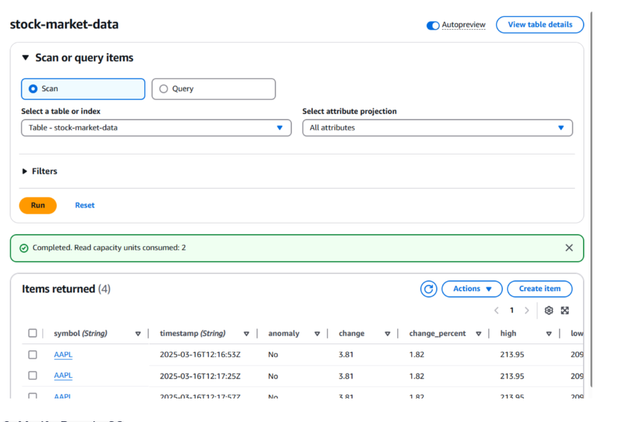

**2. Verify Data in S3**

- Open **AWS Console → S3 → stock-market-data-bucket-33454**

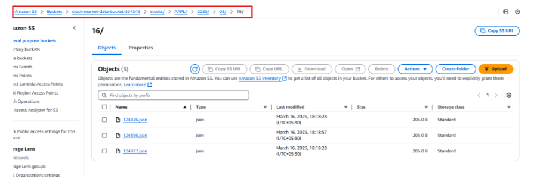

✅ **You have successfully processed real-time stock data with Lambda and stored it in DynamoDB and S3!**

---

## 3. Query Historical Stock Data using Amazon Athena

### Steps
1. Create a Glue Catalog Table for Athena
2. Create an S3 Bucket to store Query Results
3. Query Data Using Athena

---

### 3.1 Create a Glue Catalog Table for Athena

**Why Amazon Athena?**

| Feature | Benefit |
|---|---|
| Serverless SQL | Query S3 data without setting up a database |
| Cost-Effective | Pay only for data scanned |
| Scalable | Handles large datasets with ease |

> Amazon Athena requires a **Glue Data Catalog** to define the schema of S3 data.

**1.** Open **AWS Console → AWS Glue**

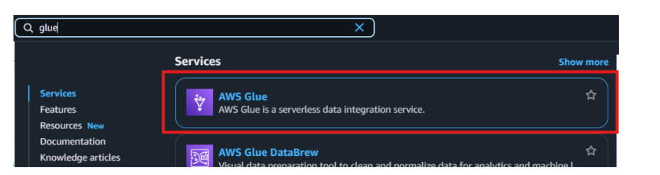

**2.** Click **Data Catalog → Databases**

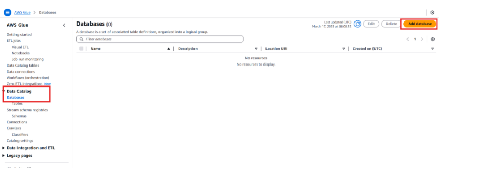

**3.** Click **Create Database**
- **Database Name:** `stock_data_db`
- Click **Create**

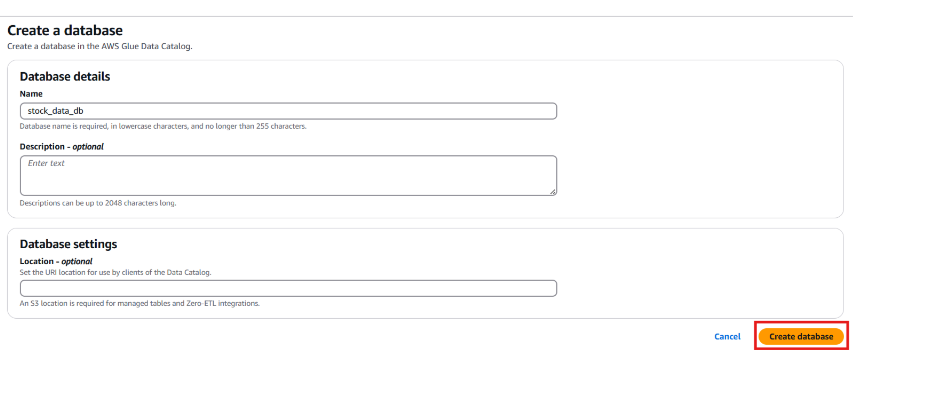

---

## ➡️ Final Result

A fully functional near real-time stock analytics pipeline built using AWS services:
yfinance (Python Script)
↓
Amazon Kinesis Data Streams
↓
AWS Lambda (Processing + Anomaly Detection)
↓               ↓
DynamoDB          Amazon S3
(Fast queries)    (Raw storage)
↓
Amazon Athena
(SQL queries)
↓
Amazon SNS
(Email/SMS Alerts)

| Feature | Implementation |
|---|---|
| **Event-driven ingestion** | Amazon Kinesis Data Streams |
| **Anomaly detection** | AWS Lambda price change logic |
| **Low-latency storage** | DynamoDB with symbol + timestamp key |
| **Historical archiving** | S3 + Athena for SQL queries |
| **Real-time alerts** | SNS Email/SMS notifications |
| **Security** | IAM roles with least privilege |
| **Cost optimization** | Serverless + On-demand pricing |

> ⚠️ **Note:** This project implements a **near real-time** pipeline. Stock data is processed by Lambda and stored in DynamoDB with a ~30 second delay. The primary goal is hands-on learning while keeping AWS costs low (~$1-2).
