# 📈 Real-Time Stock Market Data Analytics Pipeline on AWS

> Event-driven architecture | Serverless technologies | Real-time data ingestion | AWS Kinesis • Lambda • DynamoDB • S3 • Athena • SNS

---

## 📋 Overview

This project builds a **real-time stock market data analytics pipeline** using AWS, leveraging event-driven architecture and serverless technologies. The architecture ingests, processes, stores, and analyzes stock market data in real-time while minimizing costs.

### Key Features
- 📡 Stream real-time stock data from **Yahoo Finance** using **Amazon Kinesis Data Streams**
- ⚡ Process data and detect anomalies with **AWS Lambda**
- 🗄️ Store processed stock data in **Amazon DynamoDB** for low-latency querying
- 🪣 Store raw stock data in **Amazon S3** for long-term analytics
- 🔍 Query historical data using **Amazon Athena**
- 🔔 Send real-time stock trend alerts using **AWS Lambda & Amazon SNS** (Email/SMS)

---

## 🏗️ Architecture


---

## 🛠️ Services Used

| Service | Purpose |
|---|---|
| **Amazon Kinesis Data Streams** | Ingests stock data in real-time |
| **AWS Lambda** | Processes stock data and detects stock trends |
| **Amazon DynamoDB** | Stores structured stock data for quick lookups |
| **Amazon S3** | Stores raw stock data for historical analysis |
| **Amazon Athena** | Queries stock data directly from S3 |
| **Amazon SNS** | Sends stock trend alerts via Email/SMS |
| **IAM Roles & Policies** | Manages permissions securely |

---

## ⚙️ Estimated Time & Cost

- ⏱️ **Time:** ~2-3 hours
- 💰 **Cost:** ~$1 to ~$2

---

## 📌 Steps to be Performed

1. [Setting Up Data Streaming with Amazon Kinesis](#1-setting-up-data-streaming-with-amazon-kinesis)
2. [Processing Data with AWS Lambda](#2-processing-data-with-aws-lambda)
3. [Query Historical Stock Data using Amazon Athena](#3-query-historical-stock-data-using-amazon-athena)
4. [Stock Trend Alerts using SNS](#4-stock-trend-alerts-using-sns)

---

## 1. Setting Up Data Streaming with Amazon Kinesis

### Steps
1. Create a Kinesis Data Stream
2. Set Up Your Local Python Environment
3. Write the Python Script to Stream Stock Data
4. Run the Script and Verify Data Streaming

---

### 1.1 Create a Kinesis Data Stream

Amazon Kinesis Data Streams is a managed service that collects and processes real-time data streams with minimal latency.

**a.** Log in to the AWS Management Console

**b.** Search for **Kinesis** in the AWS search bar and open it:


**c.** Click **Create data stream**


**d.** Configure the Stream:
- **Stream name** → `stock-market-stream`
- **Data Stream Capacity Mode** → Select **On-demand** (free-tier friendly)
- **Retention Period** → Keep the default 24 hours


**e.** Click **Create data stream**

Your Kinesis Data Stream is now ready! ✅


---

### 1.2 Set Up Your Local Python Environment

**1. Check Python version**

```bash
python --version
```

> If not installed, download it from [python.org](https://www.python.org/downloads/)

**2. Install Required Python Libraries**

```bash
pip install boto3 yfinance
```


- `boto3` — AWS SDK for Python (to interact with AWS services)
- `yfinance` — Fetch latest stock prices from Yahoo Finance

**3. Configure AWS Credentials**

```bash
aws configure
```


Enter the following when prompted:

AWS Access Key ID     → Enter your key
AWS Secret Access Key → Enter your secret
Default region name   → us-east-1 (or your region)
Default output format → press Enter

> **Why?** AWS CLI stores your credentials so boto3 can automatically authenticate your requests.

---

### 1.3 Write the Python Script to Stream Stock Data

**1.** Create a new file called `stream_stock_data.py`

**2.** Copy and paste the script below:

```python
import boto3
import json
import time
import yfinance as yf

# AWS Kinesis Configuration
kinesis_client = boto3.client('kinesis', region_name='us-east-1')
STREAM_NAME = "<YOUR_DATA_STREAM_NAME>"  # Replace with your actual stream name
STOCK_SYMBOL = "AAPL"
DELAY_TIME = 30  # Time delay in seconds

# Function to fetch stock data
def get_stock_data(symbol):
    try:
        stock = yf.Ticker(symbol)
        data = stock.history(period="2d")  # Fetch last 2 days to get previous close

        if len(data) < 2:
            raise ValueError("Insufficient data to fetch previous close.")

        stock_data = {
            "symbol": symbol,
            "open": round(data.iloc[-1]["Open"], 2),
            "high": round(data.iloc[-1]["High"], 2),
            "low": round(data.iloc[-1]["Low"], 2),
            "price": round(data.iloc[-1]["Close"], 2),
            "previous_close": round(data.iloc[-2]["Close"], 2),
            "change": round(data.iloc[-1]["Close"] - data.iloc[-2]["Close"], 2),
            "change_percent": round(((data.iloc[-1]["Close"] - data.iloc[-2]["Close"]) / data.iloc[-2]["Close"]) * 100, 2),
            "volume": int(data.iloc[-1]["Volume"]),
            "timestamp": time.strftime("%Y-%m-%dT%H:%M:%SZ", time.gmtime())
        }
        return stock_data
    except Exception as e:
        print(f"Error fetching stock data: {e}")
        return None

# Function to stream data into Kinesis
def send_to_kinesis():
    while True:
        try:
            stock_data = get_stock_data(STOCK_SYMBOL)
            if stock_data is None:
                print("Skipping this iteration due to API error.")
                time.sleep(DELAY_TIME)
                continue

            print(f"Sending: {stock_data}")

            # Send to Kinesis
            response = kinesis_client.put_record(
                StreamName=STREAM_NAME,
                Data=json.dumps(stock_data),
                PartitionKey=STOCK_SYMBOL
            )

            # Debugging Response
            if response["ResponseMetadata"]["HTTPStatusCode"] == 200:
                print(f"Kinesis Response: {response}")
            else:
                print(f"Error sending to Kinesis: {response}")

            time.sleep(DELAY_TIME)  # Send data every 30 seconds

        except Exception as e:
            print(f"Error: {e}")
            time.sleep(DELAY_TIME)

# Run the streaming function
send_to_kinesis()
```

> ⚠️ **Remember** to replace `<YOUR_DATA_STREAM_NAME>` with the actual name of your Kinesis Data Stream.

**What This Code Does:**

| Step | Description |
|---|---|
| **Fetches Stock Data** | Retrieves Open, High, Low, Close, Volume and Previous Close for AAPL |
| **Formats Data** | Converts stock data into a structured JSON object with timestamp |
| **Streams to Kinesis** | Sends JSON-encoded data to Kinesis every 30 seconds |
| **Handles Errors** | Waits and retries if API fails instead of crashing |
| **Logs Output** | Prints each record and Kinesis response to terminal |

**Sample record sent to Kinesis:**

```json
{
  "symbol": "AAPL",
  "open": 211.25,
  "high": 213.95,
  "low": 209.58,
  "price": 213.49,
  "previous_close": 209.68,
  "change": 3.81,
  "change_percent": 1.82,
  "volume": 60107582,
  "timestamp": "2025-03-16T09:05:09Z"
}
```

---

### 1.4 Run the Script and Verify Data Streaming

**1.** Run the Python Script:

```bash
python stream_stock_data.py
```

**Expected Output:**
Sending: {'symbol': 'AAPL', 'open': 211.25, 'high': 213.95, 'low': 209.58, 'price': 213.49,
'previous_close': 209.68, 'change': 3.81, 'change_percent': 1.82, 'volume': 60060200,
'timestamp': '2025-03-16T09:25:45Z'}
Kinesis Response: {'ShardId': 'shardId-000000000002', 'SequenceNumber': '4966146277844746...'}


**2.** Verify Data in Kinesis:
- Open **AWS Console → Kinesis → stock-market-stream**
- Click **Monitoring**
- Check **Incoming Records** graph:


> You can also check the **Data Viewer** tab and select **Trim Horizon** as your starting position to view stored records.


> ⚠️ **IMPORTANT:** Stop your Python script using `CTRL+C` when you no longer need to stream data. If left running, it will send records to Kinesis every 30 seconds and may exceed Free Tier limits.

✅ **Congratulations!** You have successfully streamed real-time stock data into Amazon Kinesis!

---

## 2. Processing Data with AWS Lambda

### Steps
1. Create a DynamoDB Table for storing Processed Stock Data
2. Create S3 Bucket for storing Raw Stock Data
3. Configure AWS Lambda in the AWS Console
4. Test the Integration

---

### 2.1 Create a DynamoDB Table

**Why DynamoDB?**

| Feature | Benefit |
|---|---|
| Fast read/write | Low-latency querying |
| Flexible schema | Easy adjustments to stock data fields |
| Scalability | Handles high-volume stock transactions |

**Stock data fields stored in DynamoDB:**


**1.** Open **AWS Console → DynamoDB**


**2.** Click **Create Table**


**3.** Configure the table:
- **Table Name:** `stock-market-data`
- **Partition Key:** `symbol` (String)
- **Sort Key:** `timestamp` (String)


**4.** Keep default settings and click **Create Table**

---

### 2.2 Create S3 Bucket for Raw Stock Data

**Why S3?**

- 📦 **Long-term storage** → Store raw stock data for historical analysis
- 🤖 **Batch processing** → Useful for training ML models on stock trends
- 🔍 **Flexible querying** → Query historical data using Amazon Athena

**1.** Open **AWS Console → S3 → Create bucket**
- **Bucket Name:** `stock-market-data-bucket-33454` (use a unique name)
- **Region:** Same region as your Lambda function
- Keep **Block Public Access** enabled
- Click **Create bucket**

---

### 2.3 Configure AWS Lambda

**Why Lambda for Processing?**
Raw Kinesis Data
↓
AWS Lambda
├── Structures data → DynamoDB (fast retrieval)
├── Computes metrics → Price changes, moving averages
├── Detects anomalies → Flags sudden spikes/drops
└── Stores raw data → S3 bucket

**1. Create IAM Role for Lambda**

- Open **AWS Console → IAM → Roles → Create Role**
- **Trusted Entity:** AWS Service → Lambda


- **Attach these policies:**
  - `AmazonKinesisFullAccess` — Read from Kinesis
  - `AmazonDynamoDBFullAccess` — Write to DynamoDB
  - `AWSLambdaBasicExecutionRole` — CloudWatch logging
  - `AmazonS3FullAccess` — Write to S3
- **Role Name:** `Lambda_Kinesis_DynamoDB_Role`


**2. Create Lambda Function**

- Open **AWS Console → Lambda**


- Click **Create Function → Author from Scratch**
  - **Function Name:** `ProcessStockData`
  - **Runtime:** Python 3.13
  - **Execution Role:** `Lambda_Kinesis_DynamoDB_Role`


- Click **Create Function**

**3. Add Kinesis Trigger**

- In **Function Overview** → Click **Add Trigger**


- Select **Kinesis** → Choose `stock-market-stream`


- Set **Batch size:** `2`


> **Understanding Batch Size:** The Lambda function waits for 2 records (1 minute at 30-second intervals) before triggering. Adjust batch size based on your record generation frequency.

**4. Deploy Lambda Code**

Paste the following code into the Lambda editor and click **Deploy**:

```python
import json
import boto3
import base64
from decimal import Decimal

# Initialize AWS Clients
dynamodb = boto3.resource("dynamodb")
s3 = boto3.client("s3")

# Resource Names
DYNAMO_TABLE = "stock-market-data"
S3_BUCKET = "stock-market-data-bucket-33454"

# Table reference
table = dynamodb.Table(DYNAMO_TABLE)

def lambda_handler(event, context):
    for record in event['Records']:
        try:
            # Decode base64 Kinesis data
            raw_data = base64.b64decode(record["kinesis"]["data"]).decode("utf-8")
            payload = json.loads(raw_data)
            print(f"Processing record: {payload}")

            # Store raw data in S3
            try:
                s3_key = f"raw-data/{payload['symbol']}/{payload['timestamp'].replace(':', '-')}.json"
                s3.put_object(
                    Bucket=S3_BUCKET,
                    Key=s3_key,
                    Body=json.dumps(payload),
                    ContentType='application/json'
                )
                print(f"Raw data saved to S3: {s3_key}")
            except Exception as s3_error:
                print(f"Failed to save raw data to S3: {s3_error}")

            # Compute stock metrics
            price_change = round(payload["price"] - payload["previous_close"], 2)
            price_change_percent = round((price_change / payload["previous_close"]) * 100, 2)
            is_anomaly = "Yes" if abs(price_change_percent) > 5 else "No"
            moving_average = (payload["open"] + payload["high"] + payload["low"] + payload["price"]) / 4

            # Structured data for DynamoDB
            processed_data = {
                "symbol": payload["symbol"],
                "timestamp": payload["timestamp"],
                "open": Decimal(str(payload["open"])),
                "high": Decimal(str(payload["high"])),
                "low": Decimal(str(payload["low"])),
                "price": Decimal(str(payload["price"])),
                "previous_close": Decimal(str(payload["previous_close"])),
                "change": Decimal(str(price_change)),
                "change_percent": Decimal(str(price_change_percent)),
                "volume": int(payload["volume"]),
                "moving_average": Decimal(str(moving_average)),
                "anomaly": is_anomaly
            }

            # Store in DynamoDB
            table.put_item(Item=processed_data)
            print(f"Stored in DynamoDB: {processed_data}")

        except Exception as e:
            print(f"Error processing record: {e}")

    return {"statusCode": 200, "body": "Processing Complete"}
```

---

### 2.4 Test the Integration

> ⚠️ **Start your Python script before testing and stop it after storing 15-20 records in DynamoDB.**

**1. Verify Data in DynamoDB**

- Open **AWS Console → DynamoDB → stock-market-data → Explore Table Items**


**2. Verify Data in S3**

- Open **AWS Console → S3 → stock-market-data-bucket-33454**


✅ **You have successfully processed real-time stock data with Lambda and stored it in DynamoDB and S3!**

---

## 3. Query Historical Stock Data using Amazon Athena

### Steps
1. Create a Glue Catalog Table for Athena
2. Create an S3 Bucket to store Query Results
3. Query Data Using Athena

---

### 3.1 Create a Glue Catalog Table for Athena

**Why Amazon Athena?**

| Feature | Benefit |
|---|---|
| Serverless SQL | Query S3 data without setting up a database |
| Cost-Effective | Pay only for data scanned |
| Scalable | Handles large datasets with ease |

> Amazon Athena requires a **Glue Data Catalog** to define the schema of S3 data.

**1.** Open **AWS Console → AWS Glue**


**2.** Click **Data Catalog → Databases**


**3.** Click **Create Database**
- **Database Name:** `stock_data_db`
- Click **Create**


### 3.2 Create a Glue Table for Stock Data

- Open **AWS Glue Console → Click Tables → Add Table**

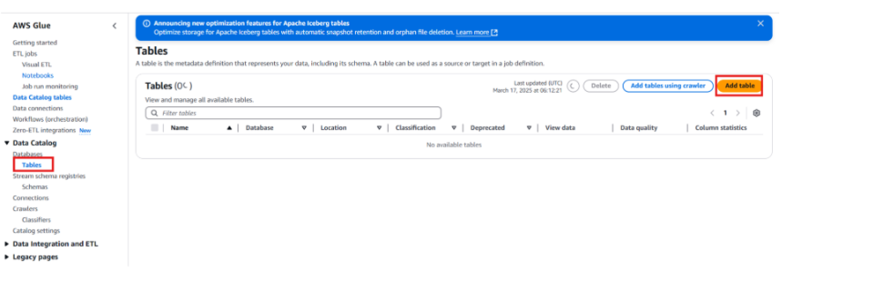

- **Table Name:** `stock_data_table`
- **Database:** Select `stock_data_db`

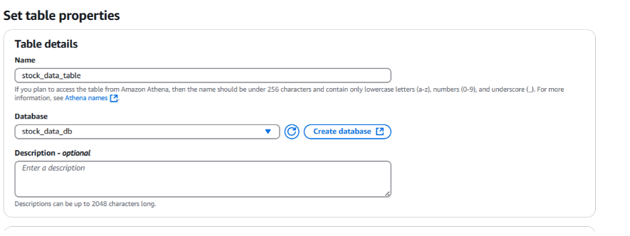

- **Table Type:** S3 Data
- **S3 Path:** `s3://<YOUR-BUCKET-NAME>/raw-data/`

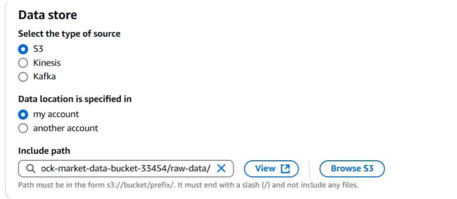

- Select **JSON** as the data format → Click **Next**

---

### 3.3 Define Table Schema

Add the following columns:

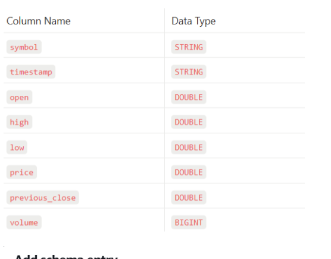

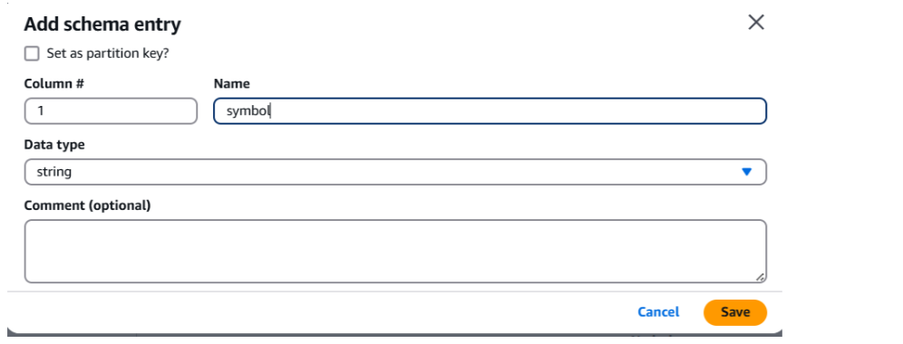

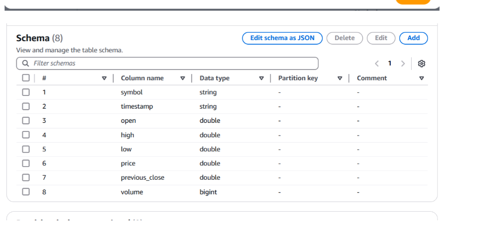

Click **Next → Review → Create Table**

---

### 3.4 Create S3 Bucket for Athena Query Results

1. Go to **AWS S3 Console → Create Bucket**
2. **Name:** `athena-query-results-<unique-id>`

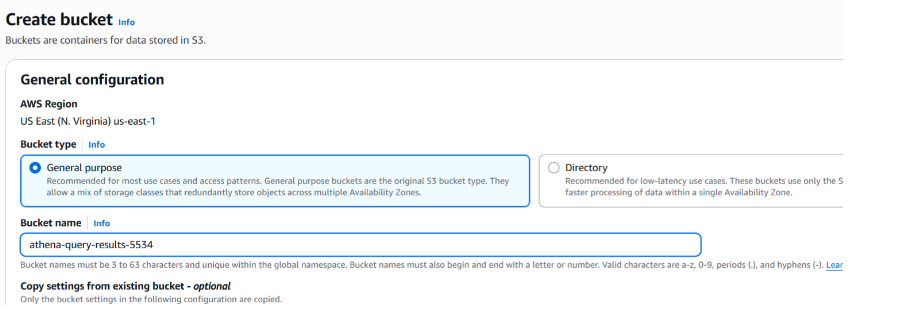

3. Leave defaults → Click **Create Bucket**

---

### 3.5 Query Data Using Athena

1. Open **AWS Console → Amazon Athena → Launch Query Editor**

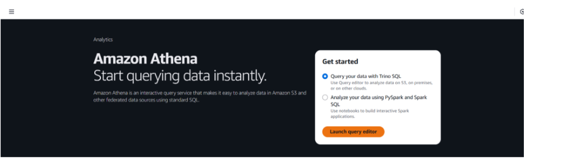

2. Select `stock_data_db` as the database

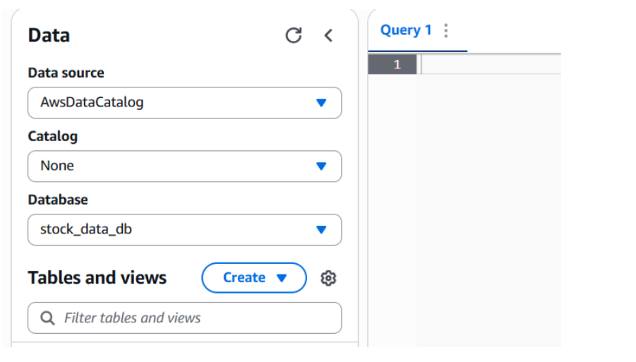

3. Set up query results location → Click **Edit Settings** → Select your S3 bucket → Click **Save**

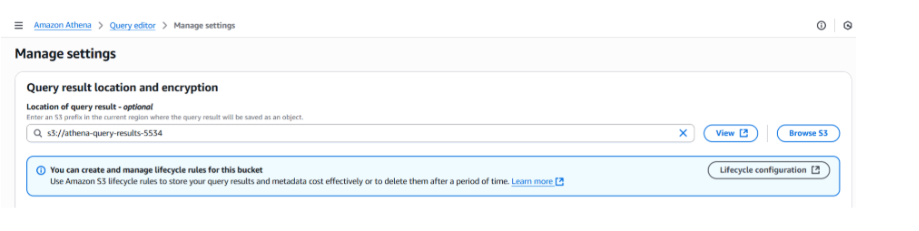

4. Run a basic query:

```sql
SELECT * FROM stock_data_table LIMIT 10;
```

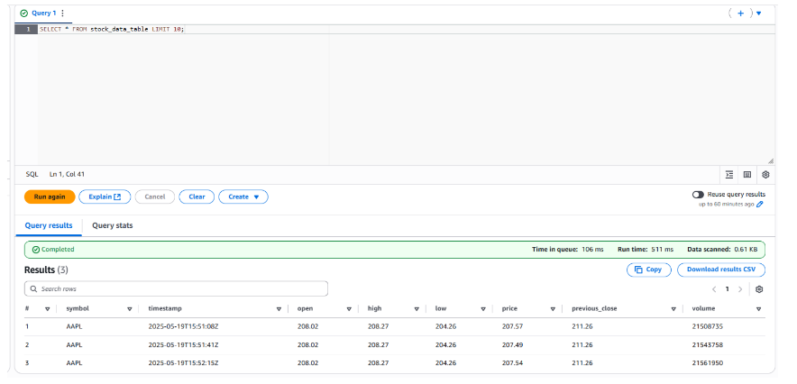

---

### Advanced Athena Queries

**1. Top 5 Stocks with Highest Price Change:**

```sql
SELECT symbol, price, previous_close,
       (price - previous_close) AS price_change
FROM stock_data_table
ORDER BY price_change DESC
LIMIT 5;
```

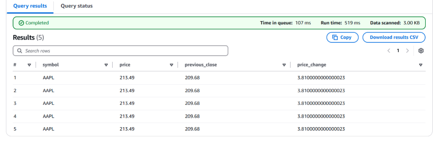

**2. Average Trading Volume Per Stock:**

```sql
SELECT symbol, AVG(volume) AS avg_volume
FROM stock_data_table
GROUP BY symbol;
```

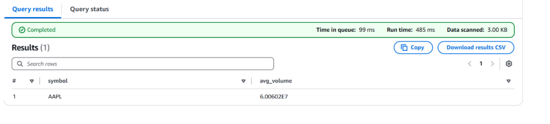

**3. Find Anomalous Stocks (Price Change > 5%):**

```sql
SELECT symbol, price, previous_close,
       ROUND(((price - previous_close) / previous_close) * 100, 2) AS change_percent
FROM stock_data_table
WHERE ABS(((price - previous_close) / previous_close) * 100) > 5;
```

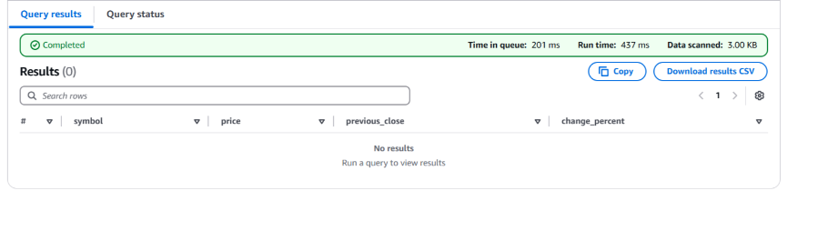

> No anomalous stocks detected from the current data source.

✅ **You can now query historical stock data using Amazon Athena!**

---

## 4. Stock Trend Alerts using SNS

### Steps
1. Enable DynamoDB Streams
2. Create an SNS Topic
3. Create an IAM Role for Lambda
4. Create Lambda for Trend Analysis

---

### 4.1 Enable DynamoDB Streams

**Why DynamoDB Streams?**

DynamoDB Streams capture real-time data changes
↓
Lambda reads the stream
↓
Analyzes stock trends
↓
SNS sends Email/SMS alerts

1. Open **AWS DynamoDB Console → Select `stock-market-data` table**
2. Click **Exports and Streams → Enable DynamoDB Streams**

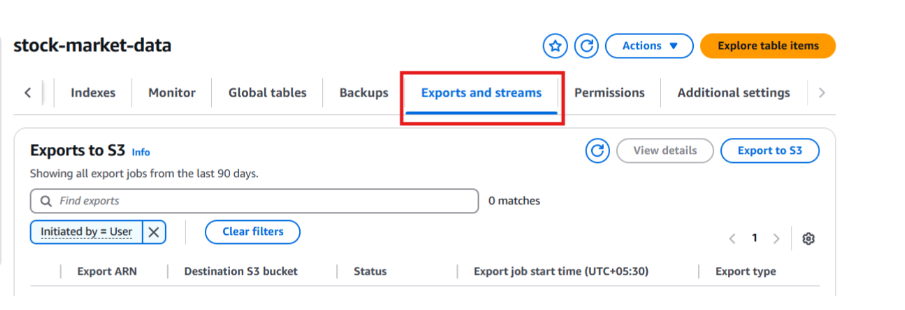

3. Select **New image** (captures the latest version of each record)

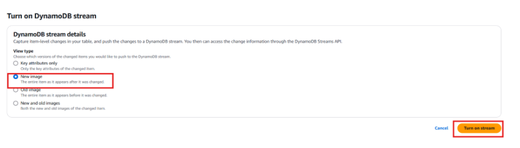

4. Click **Turn on stream**

---

### 4.2 Create an SNS Topic

1. Go to **AWS SNS Console → Create Topic**
2. **Type:** Standard
3. **Topic Name:** `Stock_Trend_Alerts`

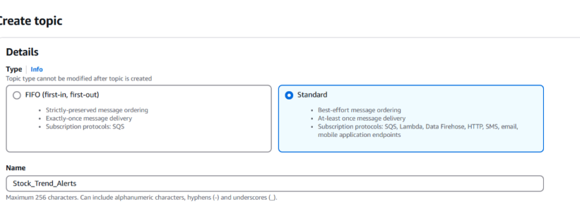

4. Leave defaults → Click **Create Topic**

5. **Add Subscribers → Click Create Subscription**

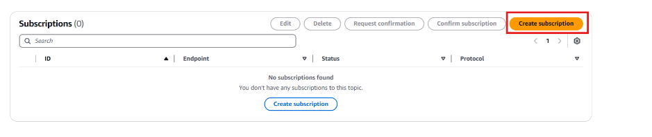

- **Protocol:** Email or SMS
- **Endpoint:** Enter your email address or phone number

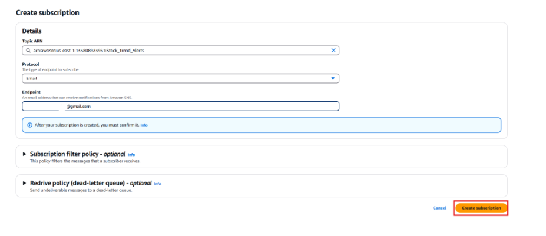

- Click **Create Subscription**
- Confirm via the email or SMS you receive

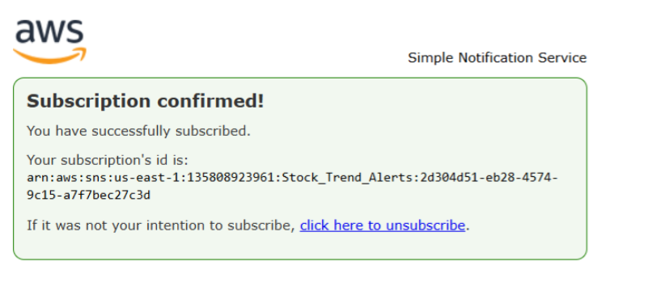

---

### 4.3 Create IAM Role for Lambda

1. Go to **AWS IAM Console → Roles → Create Role**
2. **Trusted Entity:** AWS Service → Lambda

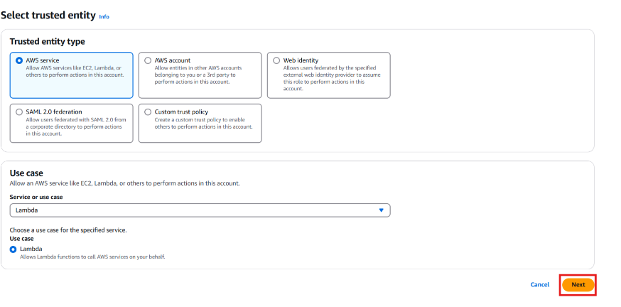

3. **Attach these policies:**
   - `AmazonDynamoDBFullAccess` — Read stock data
   - `AmazonSNSFullAccess` — Publish alerts to SNS
   - `AWSLambdaBasicExecutionRole` — CloudWatch logs

4. **Role Name:** `StockTrendLambdaRole` → Click **Create Role**

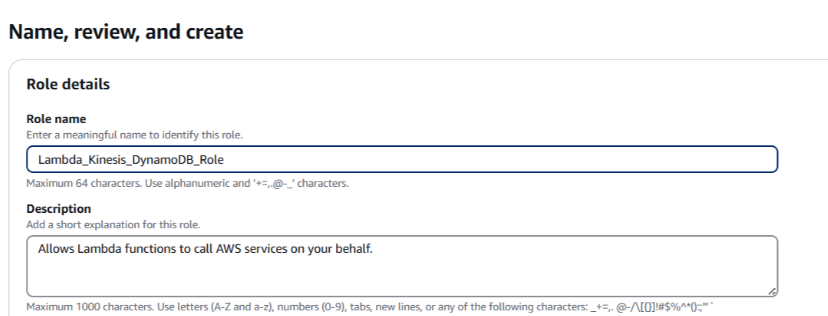

---

### 4.4 Create Lambda for Trend Analysis

1. Go to **AWS Lambda Console → Create Function**
2. **Author from Scratch**
   - **Function Name:** `StockTrendAnalysis`
   - **Runtime:** Python 3.13

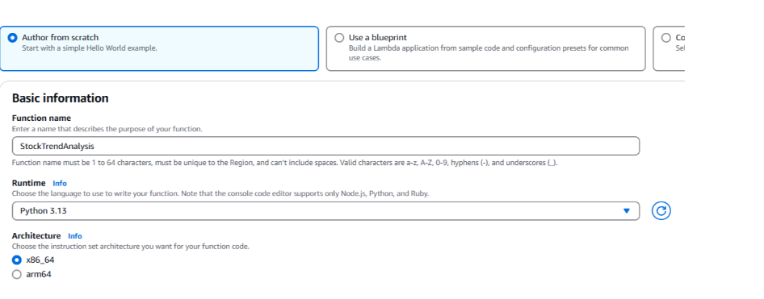

3. **Permissions:** Use existing role → Select `StockTrendLambdaRole`

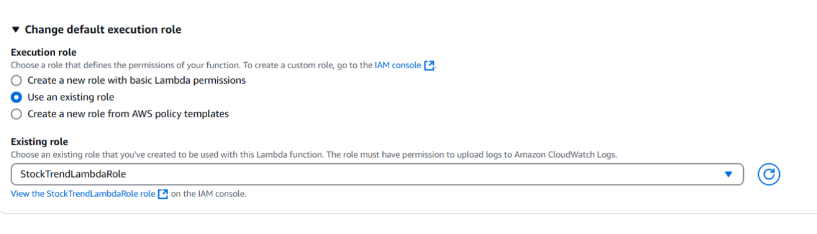

4. Click **Create Function**

5. Click **Add Trigger**

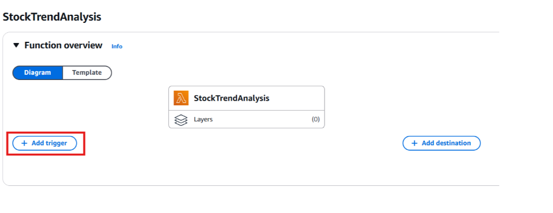

6. Select **DynamoDB** → Choose `stock-market-data` → **Batch size:** `2`

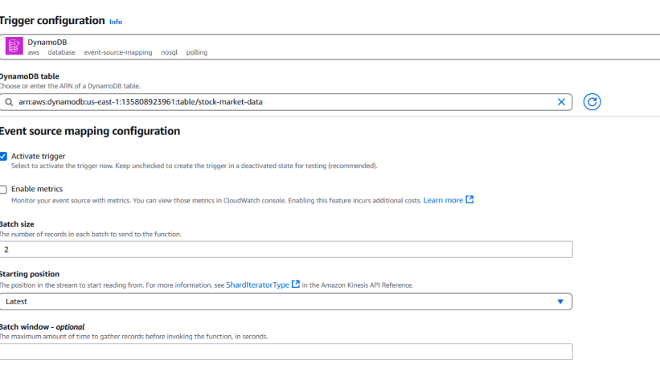

7. Paste the Lambda code below and click **Deploy:**

```python
import boto3
import json
import decimal
from datetime import datetime, timedelta

# AWS Clients
dynamodb = boto3.resource("dynamodb")
sns = boto3.client("sns")

# DynamoDB Table Name and SNS ARN
TABLE_NAME = "<YOUR-DYNAMODB-TABLE-NAME>"
SNS_TOPIC_ARN = "<YOUR-SNS-TOPIC-ARN>"

def get_recent_stock_data(symbol, minutes=5):
    """Fetch stock data for the last 'minutes' from DynamoDB"""
    table = dynamodb.Table(TABLE_NAME)
    now = datetime.utcnow()
    past_time = now - timedelta(minutes=minutes)

    try:
        response = table.query(
            KeyConditionExpression="symbol = :symbol AND #ts >= :time",
            ExpressionAttributeNames={"#ts": "timestamp"},
            ExpressionAttributeValues={
                ":symbol": symbol,
                ":time": past_time.strftime("%Y-%m-%d %H:%M:%S"),
            },
            ScanIndexForward=True
        )
        return sorted(response.get("Items", []), key=lambda x: x["timestamp"])

    except Exception as e:
        print(f"Error fetching stock data: {e}")
        return []

def calculate_moving_average(data, period):
    """Calculate moving average for given period"""
    if len(data) < period:
        return decimal.Decimal("0")
    return sum(decimal.Decimal(d["price"]) for d in data[-period:]) / period

def lambda_handler(event, context):
    """Main Lambda function"""
    symbols = ["AAPL"]

    for symbol in symbols:
        stock_data = get_recent_stock_data(symbol)

        if len(stock_data) < 20:
            continue

        # Compute Moving Averages
        sma_5 = calculate_moving_average(stock_data, 5)
        sma_20 = calculate_moving_average(stock_data, 20)
        sma_5_prev = calculate_moving_average(stock_data[:-1], 5)
        sma_20_prev = calculate_moving_average(stock_data[:-1], 20)

        if None not in (sma_5, sma_20, sma_5_prev, sma_20_prev):
            message = None

            # Detect Trend Change
            if sma_5_prev < sma_20_prev and sma_5 > sma_20:
                message = f"{symbol} is in an **Uptrend**! Consider a buy opportunity."
            elif sma_5_prev > sma_20_prev and sma_5 < sma_20:
                message = f"{symbol} is in a **Downtrend**! Consider selling."

            # Publish SNS Alert
            if message:
                try:
                    sns.publish(
                        TopicArn=SNS_TOPIC_ARN,
                        Message=message,
                        Subject=f"Stock Alert: {symbol}"
                    )
                except Exception as e:
                    print(f"Failed to publish SNS message: {e}")

    return {"statusCode": 200, "body": json.dumps("Trend analysis complete")}
```

> ⚠️ Replace `<YOUR-DYNAMODB-TABLE-NAME>` and `<YOUR-SNS-TOPIC-ARN>` with your actual values.
>
> **How to find your SNS Topic ARN:** AWS Console → SNS → Topics → Select your topic → Copy ARN from Details section.

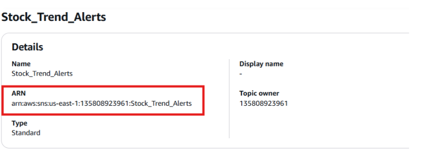

---

### How Trend Detection Works

Stock Data (last 5 minutes)
↓
SMA-5  = Average of last 5 price records  (short-term)
SMA-20 = Average of last 20 price records (long-term)
↓
SMA-5 crosses ABOVE SMA-20 → 📈 UPTREND  → BUY alert sent via SNS
SMA-5 crosses BELOW SMA-20 → 📉 DOWNTREND → SELL alert sent via SNS

**Lambda Code Breakdown:**

| Step | Function | Description |
|---|---|---|
| 1 | `get_recent_stock_data()` | Queries DynamoDB for last 5 minutes of stock prices |
| 2 | `calculate_moving_average()` | Computes SMA-5 and SMA-20 averages |
| 3 | Trend detection | Compares current vs previous SMAs to detect crossovers |
| 4 | `sns.publish()` | Sends BUY/SELL alert to subscribed emails/phones |

✅ **Congratulations! You have successfully completed the Stock Market Real-Time Data Analytics Pipeline on AWS!**

---

## 🧹 Clean Up

> ⚠️ **Delete all resources to avoid ongoing AWS charges**

| Resource | Steps |
|---|---|
| **Kinesis Data Stream** | Kinesis Console → Select stream → Delete |
| **Lambda Functions** | Lambda Console → Select `ProcessStockData` and `StockTrendAnalysis` → Delete |
| **DynamoDB Table** | DynamoDB Console → Select `stock-market-data` → Delete Table |
| **SNS Topic** | SNS Console → Select `Stock_Trend_Alerts` → Delete |
| **S3 Buckets** | S3 Console → Empty bucket first → Delete bucket |
| **Athena Tables** | Athena Console → Delete tables and saved queries |
| **IAM Roles** | IAM Console → Delete project-specific roles and policies |

---

## 🏁 Conclusion

This project demonstrates how to build a **near real-time stock market data analytics pipeline** using AWS fully managed serverless services.

**Key outcomes:**

| Outcome | Implementation |
|---|---|
| Real-time data ingestion | Amazon Kinesis Data Streams |
| Event-driven processing | AWS Lambda triggered by Kinesis |
| Anomaly detection | Price change percentage threshold logic |
| Trend analysis | Simple Moving Average crossover strategy |
| Low-latency storage | DynamoDB for fast structured queries |
| Historical archiving | S3 + Athena for serverless SQL analytics |
| Real-time alerting | SNS Email/SMS notifications |
| Security | IAM least privilege roles per service |
| Cost optimization | Serverless + On-demand pricing (~$1-2) |

> **Note:** This pipeline processes stock data with a ~30 second delay making it **near real-time** rather than fully real-time. For a true real-time system, consider using **Amazon OpenSearch Service**. The primary goal here is hands-on learning while keeping costs low.

---

## 🔗 Related Resources

- [Amazon Kinesis Documentation](https://docs.aws.amazon.com/kinesis/)
- [AWS Lambda Documentation](https://docs.aws.amazon.com/lambda/)
- [Amazon DynamoDB Documentation](https://docs.aws.amazon.com/dynamodb/)
- [Amazon Athena Documentation](https://docs.aws.amazon.com/athena/)
- [Amazon SNS Documentation](https://docs.aws.amazon.com/sns/)
